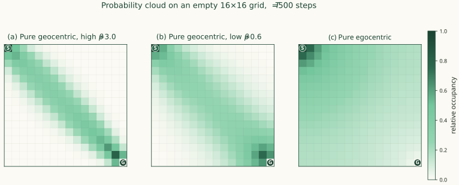
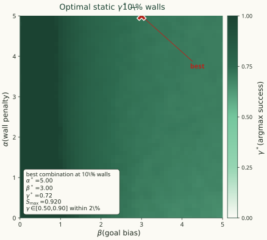
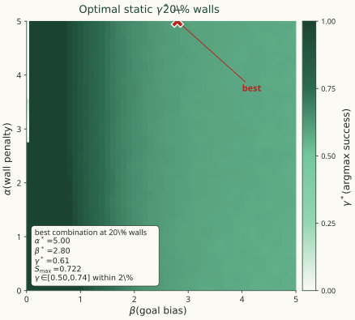
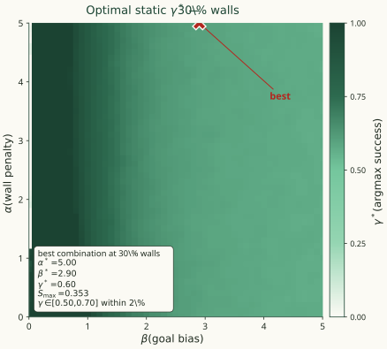
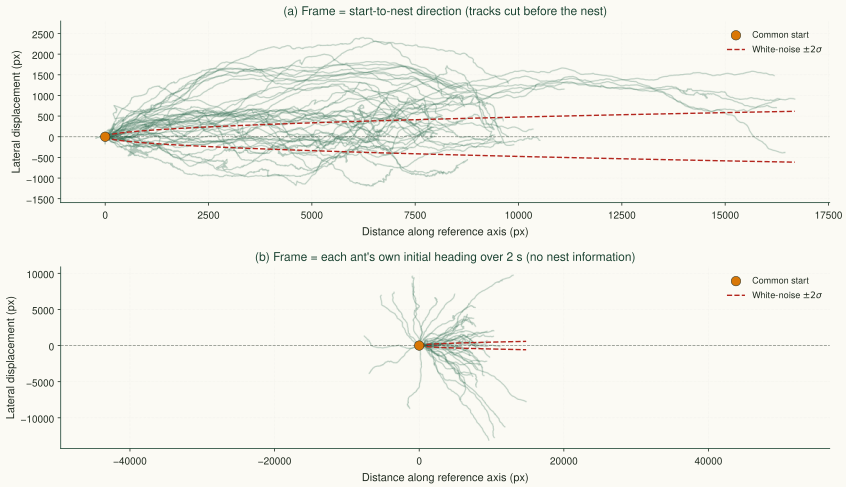
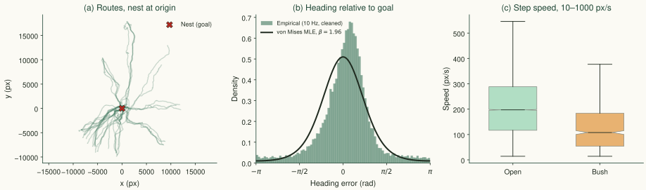
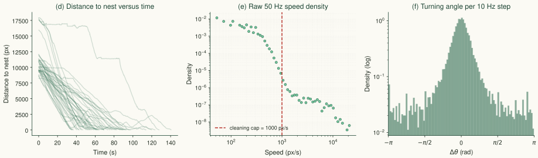
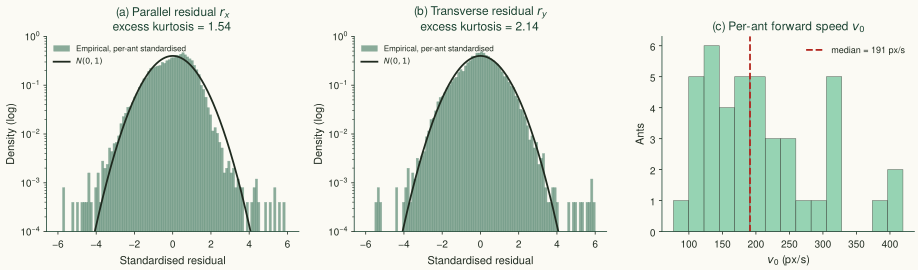
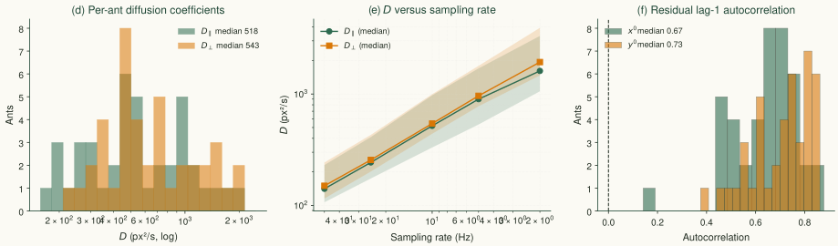
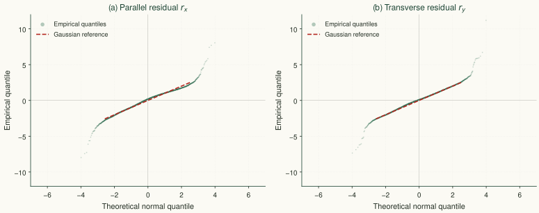

<!--
EDITING RULES (for any editing agent; read first)

1. Structure: `#` = section divider, `##` = one slide. One slide = at most one figure and about 40 words.
   Extra detail goes into tabs (`::: {.panel-tabset}` with `###` tab headings), speaker notes (`::: notes`), or the Appendix.
2. Style (from the 3 Cs: consistency, clarity, coherence):
   - one palette, one font, one figure style for all plots; the same symbol or color keeps the same meaning on every slide;
   - gamma always uses the same colormap and the same axis orientation (alpha vertical, beta horizontal) in every figure;
   - panels in one figure share axes, scales and label sizes; panel letters (a), (b), ...
3. Tone: factual statements only. No taglines, no evaluative phrases, no claims beyond the evidence.
   Example: write "Worst-case optimality is impossible without memory; average-case optimality over the prior is computable."
   Do not append claims about evolution or "not ad hoc"-type phrases.
4. Porting from main.tex (line numbers refer to main_1_.tex):
   \begin{frame}{T} -> `## T`            \textbf{x} -> **x**          \textit{x} -> *x*
   itemize -> `- `   enumerate -> `1. `    equations -> $...$ and $$...$$ (MathJax; use aligned for multi-line)
   columns -> `:::: {.columns}` + `::: {.column width="50%"}` ... `:::` ... `::::`
   \begin{block}{T} -> `::: {.block}` + `**T**` ... `:::`      \textcolor{red}{x} -> `[x]{.red}`
   \footnotesize / \scriptsize -> add `{.smaller}` to the slide heading or wrap text in `[...]{.small}`
   \vspace, \hfill, \pause -> delete. TikZ -> compile as standalone, export SVG, include as image.
5. Figures: SVG preferred (stays sharp when zoomed), else PNG at 300 dpi. Files go in figures/ named <topic>_<variant>.svg.
   Viewers can Alt+click (Ctrl+click on Linux) any element to zoom, and press O for the slide overview.
6. Links: GitHub Pages / external pages open as an overlay. Pages that block embedding (github.com) need {target="_blank"}.
7. Items marked TODO(user) need a decision from the author; do not invent values.
-->

## The Problem: Generalization in Navigation

Agents must navigate complex, unseen environments efficiently. This requires balancing two conflicting objectives:

:::: {.columns}
::: {.column width="48%"}
::: {.col-title}
Exploitation (Geocentric)
:::

- Driven by global cues
- Aggressively pulls toward the goal
- Highly efficient in free space
:::

::: {.column width="4%"}
:::

::: {.column width="48%"}
::: {.col-title}
Exploration (Egocentric)
:::

- Driven by local sensory feedback
- Avoids immediate obstacles
- Prevents getting trapped in clutter
:::
::::

::: {.block .ctr}
**The Core Question:** How do we dynamically switch between these strategies ($\gamma$) to optimize survival and success?
:::

## Research Roadmap (Part 1: Macroscopic Dynamics)

::: {.roadmap}
::: {.step}
**1. Behavioral Policies**\
[Derived via Constrained Optimization (MaxEnt)]{.small}
:::

::: {.step}
**2. Master Equation**\
[Discrete Grid-World Probability Flow]{.small}
:::

::: {.step}
**3. Kramers-Moyal Expansion**\
[Bridging the Discrete-to-Continuum Limit]{.small}
:::

::: {.step}
**4. Non-Linear Fokker-Planck Equation**\
[Full Macroscopic PDE]{.small}
:::

::: {.step .highlight}
**5. Linearized Fokker-Planck Equation**\
[Extracted via Small Angle Approximation ($\theta \ll 1$)]{.small}
:::
:::

## Research Roadmap (Part 2: Statistics & Control)

::: {.roadmap}
::: {.step}
**6. Continuous First Passage Time (FPT)**\
[**1D Reduction:** Quasi-2D assumption along the goal axis]{.small}\
[(Agent fluctuates transversely but moves longitudinally)]{.small}
:::

::: {.step}
**7. Discrete First Passage Time**\
[Biased Random Walk: Free Space vs. Annealed Disorder]{.small}
:::

::: {.step .highlight .to-future}
**8. Inverse Stochastic Optimal Control**\
[Deriving Cost Functionals directly from the SDE]{.small}
:::

::: {.step .future}
**9. The Optimal Switching Problem**\
[Criterion: success rate (conditional MFPT is survivorship-biased)]{.small}
:::
:::

## Research Roadmap (Part 3: The Optimal Switching Problem)

::: {.roadmap}
::: {.step}
**9. The Static-$\gamma$ Landscape**\
[$\gamma^*$ interior (0.3--0.8), decreasing in $\beta$; $\gamma=1$ never optimal by success]{.small}
:::

::: {.step}
**10. Simulation Audit & Trap-Topology Mechanism**\
[int32$\to$uint8 loader bug $\Rightarrow$ striped 9.4% mazes (artificial $\gamma^*=1$)]{.small}
:::

::: {.step .highlight .to-future}
**11. Dynamic $\gamma$: HJB & Soft Bellman**\
[Optimal switching is a Sigmoid of a switching function (Soft Bang-Bang)]{.small}
:::

::: {.step .future}
**12. Information Ceiling & Memory Tiers**\
[Switching function needs global $V$; M0/M1/M2 augmentations]{.small}
:::
:::

## Research Roadmap (Part 4: Validation & Grounding)

<!-- TODO(user): step 16 still quotes beta ~ 3.78 (pre-cleaning). The cleaned estimates give beta = 2.04 [1.72, 2.43] from headings and 4.1 [2.8, 7.2] from kappa/v0. Update this line and step 15 when the grounding section is finalized. -->

::: {.roadmap}
::: {.step}
**13. Symbolic & Algebraic Verification**\
[Continuum limits and HJB minimization checked via Mathematica]{.small}
:::

::: {.step}
**14. Monte Carlo FPT Ensembles**\
[Regime sweeps at true density; success-rate and MFPT landscapes]{.small}
:::

::: {.step .highlight}
**15. Pipeline Validation: Synthetic Benchmark**\
[Pooled MLE recovers $\kappa$ within 1.1%; all parameters within 4%]{.small}
:::

::: {.step}
**16. Biological Grounding: Wild Ant Homing**\
[Kinematics $(v_0, \kappa, D_\parallel/D_\perp)$, inversion $\beta$ ; open vs. clutter]{.small}
:::
:::

# Model {#sec-model}

::: {.sec-desc}
Discrete max-entropy policies → Fokker–Planck continuum → inverse recovery of the cost the agent minimizes.
:::

## 1. Optimal Behavioral Policies

Biological strategies are **mathematically optimal solutions** derived via the *Maximum Entropy Principle*.

:::: {.columns}
::: {.column width="48%"}
::: {.ctr}
**Geocentric (Goal Pull)**\
*Maximize goal alignment $\phi_a$*

$$\pi_G(a|s) = \frac{1}{Z_G}\exp(\beta\,\phi_a)$$

[$\beta$: Goal pull strength]{.small}
:::
:::

::: {.column width="4%"}
:::

::: {.column width="48%"}
::: {.ctr}
**Egocentric (Repulsion)**\
*Minimize obstacle overlap $O_a$*

$$\pi_E(a|s) = \frac{1}{Z_E}\exp(-\alpha\,O_a)$$

[$\alpha$: Obstacle repulsion strength]{.small}
:::
:::
::::

::: {.ctr}
**The Combined Mixture Policy:**

$$\pi(a|s) = {\color{#b3261e}\gamma}\,\pi_G(a|s) + (1-{\color{#b3261e}\gamma})\,\pi_E(a|s)$$

[Where $\gamma \in [0,1]$ is the dynamic switching parameter.]{.small}
:::

## Try it yourself

Change the parameters. Watch the behavior.

Adjust the mixture weight $\gamma$, drive strengths $\alpha$ and $\beta$, and population density to see how the agent's trajectory changes.

::: {.ctr .small}
[**Open the interactive simulation →**](https://claude.ai/artifact/1iNbxzQRmGMtd1SD5g2CK4){target="_blank"}
:::

## 2. From Micro to Macro Dynamics

How does this discrete policy translate to the continuous movement of a **probability cloud**?

1. **Master Equation:** Tracks exact probability flow between grid cells.
2. **Kramers-Moyal Expansion:** Taylor expansion in powers of spatial step size $\epsilon$.
3. **Truncation:** Keeping terms up to $\mathcal{O}(\epsilon^2)$ yields the...

**Fokker-Planck Equation:**

::: {.large}
$$\frac{\partial P}{\partial t} = \underbrace{-\nabla\cdot\left[\bar M^{(1)}(\vec r)\,P\right]}_{\text{Drift}} + \underbrace{\frac12\nabla\nabla:\left[\bar M^{(2)}(\vec r)\,P\right]}_{\text{Diffusion}}$$
:::

## 3. The Linearized Fokker-Planck (Drift Dynamics) {.smaller}

Assuming a small angle to the goal ($\theta \ll 1$), the macroscopic PDE is:

$$\frac{\partial P}{\partial t} = -\partial_x\left[{\color{#1f5fa8}V_x}\,P\right] - \partial_y\left[{\color{#1f5fa8}V_y}\,P\right] + D_\parallel\,\partial_{xx}P + D_\perp\,\partial_{yy}P$$

**Explicit Effective Velocities (Drift):**

$$\begin{aligned}
{\color{#1f5fa8}V_x(\mathbf r)} &= \underbrace{\gamma\epsilon\tanh(\beta/2)}_{v_0\ \text{(Forward Advection)}} - \underbrace{\frac{{\color{#b3261e}(1-\gamma)}\,\alpha\epsilon^2}{2}\,\partial_x O(\mathbf r)}_{\text{Obstacle Repulsion}} \\[1ex]
{\color{#1f5fa8}V_y(\mathbf r)} &= \underbrace{\left[\frac{\gamma\epsilon\beta}{4\cosh^2(\beta/2)}\right]\theta(\mathbf r)}_{\kappa\theta\ \text{(Transverse Restoring)}} - \underbrace{\frac{{\color{#b3261e}(1-\gamma)}\,\alpha\epsilon^2}{2}\,\partial_y O(\mathbf r)}_{\text{Obstacle Repulsion}}
\end{aligned}$$

- **Advection & Restoring:** Scaled by $\gamma$ and goal bias $\beta$.
- **Repulsion:** Scaled by the exploration parameter $(1-\gamma)$ and penalty $\alpha$.

## 3. The Linearized Fokker-Planck (Diffusion Dynamics)

The probability cloud spreads according to the **Effective Diffusion Tensor**:

:::: {.columns}
::: {.column width="50%"}
$$D_\parallel = \underbrace{\frac{\gamma\epsilon^2\cosh\beta}{2(1+\cosh\beta)}}_{\text{Geocentric}} + \underbrace{\frac{{\color{#b3261e}(1-\gamma)}\,\epsilon^2}{2}}_{\text{Egocentric}}$$
:::

::: {.column width="50%"}
$$D_\perp = \underbrace{\frac{\gamma\epsilon^2}{2(1+\cosh\beta)}}_{\text{Geocentric}} + \underbrace{\frac{{\color{#b3261e}(1-\gamma)}\,\epsilon^2}{2}}_{\text{Egocentric}}$$
:::
::::

**Key Limiting Behaviors:**

- **Isotropic Limit ($\gamma \to 0$):** $D_\parallel = D_\perp = \epsilon^2/2$. The pure egocentric policy spreads equally in all directions (unbiased exploration).
- **Anisotropic Limit ($\gamma = 1,\ \beta \to \infty$):** $D_\parallel/D_\perp = \cosh\beta \to \infty$. The pure geocentric policy diffuses heavily along the goal axis but barely transversely.

## Fokker-Planck modes on an empty grid

{width=72%}

**(a) Pure geocentric, high $\beta$.** Sharp goal bias. The cloud is a **tight cigar** along the goal diagonal: strong forward drift $v_0$, small transverse noise $D_\perp$.

**(b) Pure geocentric, low $\beta$.** Same goal-directed drift, **wider cloud**. Transverse restoring $\kappa$ is weak, so off-axis steps survive.

**(c) Pure egocentric.** No goal bias, no drift. The cloud spreads **isotropically** from the start. $v_0 = \kappa = 0$ and $D_\parallel = D_\perp = \epsilon^2/2$.

## Next Phase: The Control Problem

::: {.ctr style="margin-top: 2.2em;"}
*Given these macroscopic dynamics...*

**What objective function is the agent actually minimizing to yield these policies, and what does it tell us about optimal $\gamma$?**
:::

## 4. Inverse Stochastic Optimal Control

To understand how to tune $\gamma$, we must ask: **What is the agent actually optimizing?**

We map the macroscopic Fokker-Planck dynamics back to a microscopic Stochastic Differential Equation (SDE):

::: {.large}
$$d\mathbf r_t = \mathbf V(\mathbf r_t)\,dt + \mathbf B\,d\mathbf W_t$$
:::

Using Girsanov's Theorem and the Hamilton-Jacobi-Bellman (HJB) equation, we work *backwards* from the known velocity field $\mathbf V$ to find the exact **State Cost $q(x,y)$** the agent minimizes.

## The Exact Continuous State Cost {.smaller}

The exact HJB state cost reveals the physical penalties the agent avoids:

$$q(x,y) = \underbrace{\frac{1}{4D_\parallel}\left(v_0 - c\,\partial_x O\right)^2 + \frac{1}{4D_\perp}\left(\kappa\theta - c\,\partial_y O\right)^2}_{\text{1. Quadratic Control Effort}} + \underbrace{\frac{\kappa}{2}\,\partial_y\theta}_{\text{2. Angular Penalty}} - \underbrace{\frac{c}{2}\,\nabla^2 O}_{\text{3. Laplacian Repulsion}}$$

:::: {.columns}
::: {.column width="31%"}
::: {.col-title}
1. Kinetic Energy
:::
Penalizes fighting against diffusion noise to maintain speed/direction.
:::

::: {.column width="31%"}
::: {.col-title}
2. Angular Penalty
:::
Penalizes rapid transverse changes in goal angle (encourages smooth arcs).
:::

::: {.column width="35%"}
::: {.col-title}
3. Curvature Penalty
:::
$\nabla^2 O$ penalizes sharp convex corners and navigation into tight, dense traps.
:::
::::

## Explicit Parametric Expansion of the State Cost {.smaller}

To map the control landscape, we expand the coefficients back to the fundamental agent parameters: goal bias ($\beta$), repulsion ($\alpha$), and the mixing weight ($\gamma$).

:::: {.columns}
::: {.column width="48%"}
::: {.col-title}
Active Drift & Repulsion
:::

$$\begin{aligned}
v_0 &= \gamma\epsilon\tanh\left(\frac{\beta}{2}\right) \\[1ex]
\kappa &= \frac{\gamma\epsilon\beta}{4\cosh^2(\beta/2)} \\[1ex]
c &= \frac{{\color{#b3261e}(1-\gamma)}\,\alpha\epsilon^2}{2}
\end{aligned}$$

[The obstacle penalty $c$ is proportional to the exploration parameter $(1-\gamma)$.]{.small}
:::

::: {.column width="4%"}
:::

::: {.column width="48%"}
::: {.col-title}
Anisotropic Diffusion Noise
:::

$$\begin{aligned}
D_\parallel &= \frac{\gamma\epsilon^2\cosh\beta}{2(1+\cosh\beta)} + \frac{{\color{#b3261e}(1-\gamma)}\,\epsilon^2}{2} \\[2ex]
D_\perp &= \frac{\gamma\epsilon^2}{2(1+\cosh\beta)} + \frac{{\color{#b3261e}(1-\gamma)}\,\epsilon^2}{2}
\end{aligned}$$
:::
::::

::: {.block}
**Role of $\gamma$**\
As $\gamma \to 1$, $c \to 0$ (the Laplacian curvature penalty vanishes) and noise becomes anisotropic ($D_\parallel \gg D_\perp$). As $\gamma \to 0$, active drift vanishes ($v_0, \kappa \to 0$) and the noise becomes isotropic.
:::

## The Discrete Analogue: Information-Theoretic Reward {.smaller}

By evaluating the Soft-Bellman equation, the exact discrete reward $r_\gamma(s)$ is:

$$r_\gamma(s) = \underbrace{V(s) - \mathbb{E}[V(s')]}_{\text{Value Drift}} + \frac{1}{\eta}\sum_{s'}\pi_\gamma^*\,\underbrace{\log\left(\frac{\gamma}{Z_G}e^{\beta V_{\text{goal}}(s')} + \frac{1-\gamma}{Z_E}e^{-\alpha O(s')}\right)}_{\text{Mixture Interference (Log-Sum-Exp)}}$$

::: {.block}
**The Log-Sum-Exp “Smooth Max”**\
Because the control cost is a *Log-Sum-Exp* of the goal ($\beta$) and obstacle ($\alpha$) terms, the agent does **not** pay the full cost of both behaviors simultaneously. It acts as a smooth maximum, representing the minimal cognitive/control effort to satisfy the dominant drive.
:::

# Static switching: optimal $\gamma$ {#sec-static}
::: {.sec-desc}
How success probability selects a mixing weight when $\gamma$ is held constant across the maze.
:::

<!--
PART B. Order of slides (old slides 16-23 reordered):
  problem statement (moved from old 22-23) -> setup -> gamma* maps -> reading the map -> survival at fixed (alpha, beta)
  -> mechanism (old 18-19) -> limits of constant gamma (old 21, as the bridge to the dynamic section).
-->

## Problem statement: mixing two stochastic 

Stripping away biological artefacts, the core problem is an **exploration vs. exploitation** tradeoff in quenched disorder.

:::: {.columns}
::: {.column width="48%"}
::: {.col-title}
Exploitation — "geocentric"
:::

**Biased random walk.**

- Constant forward drift
- Anisotropic diffusion
:::

::: {.column width="4%"}
:::

::: {.column width="48%"}
::: {.col-title}
Exploration — "egocentric"
:::

**Symmetric random walk.**

- Zero global drift
- Isotropic diffusion
- Wall repulsion as unbiased scattering
:::
::::

::: {.block .ctr}
**Open problem.** How should the two processes be optimally combined to minimise first-passage time and maximise survival?
:::

<!-- MOVED from old slides 22-23 (L546-621); merge into ONE slide, drop the word "Conclusion".
     Left: exploitation = biased random walk (forward drift + anisotropic diffusion).
     Right: exploration = symmetric random walk (zero global drift + isotropic diffusion).
     Bottom: how should the two be combined to maximize success / minimize first-passage time? -->

## Simulation setup and metric {.smaller}

:::: {.columns}
::: {.column width="48%"}
**Environment**

- 2D maze, $16\times 16$ grid.
- Obstacle density $\rho \in \{10, 20, 30, 40\}\%$.
- Start top-left, goal bottom-right.
- A move into a wall is **rejected**; the step is still consumed.

**Policy**

$$\pi(a\mid s) = \gamma\,\pi_G(a\mid s) + (1-\gamma)\,\pi_E(a\mid s)$$

held **constant in space and time** throughout a single sweep cell.
:::

::: {.column width="4%"}
:::

::: {.column width="48%"}
**Sweep**

- $\alpha, \beta \in [0, 5]$, fine grid ($0.1$).
- $\gamma \in [0, 1]$, step $0.02$.
- 1000 mazes × 30 agents per cell.
- Horizon $T = 200$ steps.

**Score used to pick $\gamma^*$**

$$S(\gamma) = \underbrace{\text{success rate}}_{\text{primary}} \;-\; \lambda\,\frac{\text{capped MFPT}}{T}$$

with $\lambda = 0.2$. Failures count as $T$, so a short MFPT on a lucky survivor cannot outrank a reliable strategy.
:::
::::

::: {.block}
**Why the composite metric.** Success rate alone leaves ties across $\gamma$. Capped MFPT alone suffers survivorship bias. The composite keeps success dominant and only uses MFPT to break the ties in favour of the faster mixture.
:::

## Optimal static $\gamma^*$ over $(\alpha,\beta)$

:::: {.columns}
::: {.column width="66%"}
::: {.panel-tabset}
### $\rho = 10\%$

### $\rho = 20\%$

### $\rho = 30\%$

### $\rho = 40\%$

:::
:::

::: {.column width="32%"}
::: {.small}
**How to read the plot**

- **Colour = $\gamma^*$**, the mixing weight that maximises the composite score at that $(\alpha, \beta)$.
- **Red X** = single best $(\alpha, \beta)$ cell for that density.
- The annotation box gives the triple $(\alpha^*, \beta^*, \gamma^*)$, the peak score, and the $\gamma$-range within 2\% of the peak — a measure of how sharp the optimum is.

[Full-resolution gallery →](https://godcreator333.github.io/Hierarchical_RL_Research/){.small}
:::
:::
::::

## Analyzing the plots {.smaller}

**What the legend says.** The colour is $\gamma^*$, **not** the score. A point being dark does not mean the agent does well there; it means the *best mixture* at that $(\alpha,\beta)$ leans heavily on goal pull. Bright means the best mixture leans on obstacle avoidance. The score itself is in the annotation box.

Three observations that hold in every density panel.

1. **A narrow stripe at $\beta \approx 0$ is forest-dark.** With essentially no goal bias, any repulsion at all biases the mixture toward pure exploitation ($\gamma^* \to 1$), because avoiding walls without a goal just wastes steps.

2. **The bulk of the map sits in the middle band, $\gamma^* \approx 0.5$–$0.6$.** Once the goal drive is meaningful ($\beta \gtrsim 0.5$), the optimal mixture is close to even, and it does not move much as $\alpha$ grows. The wall penalty saturates because the softmax policy is already near-deterministic for $\alpha \gtrsim 3$.

3. **The best cell sits in the upper-right region**: high $\beta$ and high $\alpha$ together, with $\gamma^*$ in the low 0.6s. Success requires both strong goal bias and strong avoidance — one without the other is not enough.

::: {.block}
**Caveat.** In some panels the best cell lies on the boundary of the swept range ($\alpha = 5$), so the true optimum may sit beyond the grid. The observations above are about the *shape* of the map, not the exact corner value.
:::
<!-- At most 3 bullets, written after viewing the maps (TODO(user)).
     Reference result from the earlier coarse sweep (old L505-529): gamma* = 1 for weak-to-moderate drives;
     gamma* < 1 only for alpha = beta >~ 5, saturating near 0.6. Move the old table to the Appendix. -->

<!-- ## Survival probability at fixed $(\alpha,\beta)$

::: {.panel-tabset}
### R1: weak, weak
{width=80%}
### R2: strong, strong
{width=80%}
### R3: low $\beta$, high $\alpha$
{width=80%}
### R4: high $\beta$, low $\alpha$
{width=80%}
### R5: extreme drives
{width=80%}
:::

<!-- Each figure: survival probability versus time, one curve per gamma, colour = gamma (same colormap as the maps).
     TODO(user): fix the five (alpha, beta) pairs; mark them on the gamma* map. -->
[All regimes and FPT histograms →](https://USER.github.io/REPO/gallery/survival/){.small} -->

## Mechanism: sticking versus diffusive delay

:::: {.columns}
::: {.column width="48%"}
**$\gamma \to 1$ (pure goal)**

- Near-deterministic push into concave obstacles
- No tangential exploration $\Rightarrow$ sticking at no-flux walls
- Arrival mass collapses as $\beta$ grows
:::

::: {.column width="4%"}
:::

::: {.column width="48%"}
**$\gamma \to 0$ (pure avoidance)**

- Little or no goal bias — a confined random walk
- Diffusive delay: arrival mass $\approx 0$ within the budget
- MFPT saturates at the horizon
:::
::::

::: {.block .ctr}
**Interior balance.** An intermediate $\gamma$ keeps enough goal-push to make progress and enough avoidance to slide along walls. The balance point is set by $\beta$ (sharper goal drive $\Rightarrow$ more sticking risk $\Rightarrow$ lower $\gamma^*$) and by the horizon (tighter budget $\Rightarrow$ speed over safety $\Rightarrow$ higher $\gamma^*$).
:::
<!-- PORT L477-504. Include force cancellation F_goal ~ F_rep => drift ~ 0 (old slide 22 content). -->

## Limits of a constant $\gamma$

- **High static $\gamma$.** The agent commits to the goal direction and cannot escape a concave obstacle: it pushes into the wall, sticks, and never arrives. 
- **Low static $\gamma$.** The agent ignores the goal and diffuses. In open space where the goal is reachable in a straight line, it wastes that opening and arrives late or not at all within budget.
- The **balance point depends on where the agent is**: a corridor mouth wants high $\gamma$, a dead-end wants low $\gamma$. A single constant cannot serve both.
- Therefore the mixture weight must be a **function of position** — the motivation for dynamic $\gamma$.
<!-- PORT old slide 21 (L530-545) as the bridge: a constant cannot track a spatially varying field. No derivation here. -->

# Dynamic switching {#sec-dynamic}
::: {.sec-desc}
State-dependent $\gamma(\mathbf r)$ from HJB and soft Bellman: the sigmoid law and its information ceiling.
:::

## Why dynamic $\gamma$?

**The static sweep showed that no single constant works everywhere.** We now ask: what is the optimal $\gamma(\mathbf r)$ as a function of position?

Two independent formulations give the same answer: **sigmoid law**

- **Stochastic Minimum Principle** — minimise the Hamiltonian pointwise along the trajectory.
- **Soft Bellman (discrete)** — minimise the entropy-regularised Bellman equation.

::: {style="font-size: 0.75em;"}
$$
\gamma^*(\mathbf r)=\sigma\left(-\frac{S}{\eta}\right),
\quad S=\nabla V\cdot(\mathbf v_G-\mathbf v_E)
$$

$$
\gamma^*(s)=\sigma\left(-\frac{s_d}{\eta_d}\right),
\quad s_d=Q_G(s)-Q_E(s)
$$
:::

::: {.block .small}
**Reading the law.** When the goal direction is cheaper than the wall direction, $\gamma^* \to 1$ (exploit). When the wall penalty dominates, $\gamma^* \to 0$ (explore). The temperature $\eta$ smooths the switch.

[Full derivation (PDF) →](derivations/soft_bang_bang.pdf){target="_blank" .small}
:::

## Dynamic $\gamma$: formulation and result

**Controlled diffusion** — the control enters the drift only:

$$\begin{aligned}
dx_t &= \big[{\color{#b3261e}\gamma_t}\,v_0 - (1-{\color{#b3261e}\gamma_t})\,c_E\,\partial_x O\big]\,dt + \sqrt{2D_\parallel}\,dW_{x,t}\\
dy_t &= \big[{\color{#b3261e}\gamma_t}\,\kappa\,\theta - (1-{\color{#b3261e}\gamma_t})\,c_E\,\partial_y O\big]\,dt + \sqrt{2D_\perp}\,dW_{y,t}
\end{aligned}$$

**Entropy-regularised running cost:** $L(\gamma) = 1 + \eta\,[\gamma\ln\gamma + (1-\gamma)\ln(1-\gamma)]$, where $\eta$ is the price of randomness.

**Steady-state HJB minimised over $\gamma$** (with $\mathbf p = \nabla V$):

$$\gamma^*(\mathbf r) = \sigma\!\left(-\frac{S}{\eta}\right),\qquad S = p_x(v_0 + c_E\,\partial_x O) + p_y(\kappa\theta + c_E\,\partial_y O).$$

**Discrete soft Bellman gives the same law:** $\gamma^*(s) = \sigma(-s_d/\eta_d)$, with $s_d = Q_G(s) - Q_E(s)$.

[Full derivation (PDF) →](derivations/soft_bang_bang.pdf){target="_blank" .small}

<!-- ONE slide (from old L622-710). Controlled diffusion with entropy-regularised running cost.
     Result: gamma*(r) = sigma(-S/eta), S = grad V . (v_G - v_E)   (continuous, HJB)
             gamma*(s) = sigma(-s_d/eta_d), s_d = Q_G - Q_E        (discrete, soft Bellman).
     Link: [Derivation →](#/app-physics){.small} -->

## Implication: the information ceiling

:::: {.columns}
::: {.column width="48%"}
**What the sigmoid law needs**

- The state, **and** the costate vector $\mathbf p = \nabla V$.
- $V$ solves a boundary-value problem over the *whole* maze, so $\nabla V$ is **global**.
:::

::: {.column width="4%"}
:::

::: {.column width="48%"}
**What the agent sees**

- A bearing and four neighbour occupancies.
- A corridor mouth and a trap mouth look **identical** at this resolution, yet demand opposite $\gamma$.
:::
::::

::: {.block .warn}
**Aliased observations.** No memoryless reactive policy can realise the sigmoid. The law is the **full-information optimum**, a benchmark rather than a controller.

[Full derivation (PDF) →](derivations/soft_bang_bang.pdf){target="_blank" .small}
<!-- ONE slide (from old L711-770).
     S requires the gradient of the value function, a global quantity. Agents are modelled as Markov (memoryless) in this work,
     so the law is a benchmark. Memory tiers M0 / M1 / M2: one line each.
     State as a direction: minimal memory may allow the global strategy to be recovered.
     Link: [Math →](#/app-physics){.small} -->
:::

## Memory tiers: closing the gap

**One internal ODE per tier. Same sigmoid law, richer input.**

- **M0 — none::** Local leading-order rule (bearing + walls). Trap-blind.
- **M1 — fading window::**    $\tau \dot m = s(t) - m$. Detects loops up to a horizon.
- **M2 — homing vector::**    $\dot{\mathbf h}$ = odometry $+$ bearing. Recovers the ceiling.

Because we model ants as Markov (memoryless) for tractability, the dynamic law is a **side result**. The biologically interesting question is how much memory an ant needs before it can approximate the global optimum. That question is open.

# Data and literature {#sec-data}
::: {.sec-desc}
Systematic survey of insect-homing datasets and the four-pillar gap this work fills.
:::

## Systematic data search (1/2)
<!-- Table from data/papers.csv (see cell below). TODO(user): provide the CSV; adjust column names. Needs: pip install pandas tabulate jupyter -->

Sources I investigated for real ant homing trajectories. Only **CATER** is usable out of the box; **CoffeeBeetles** is usable after contacting the authors (S3 artifact 404).

| Source (species) | Repository contains | Direct use? | Verdict |
|:---|:---|:---|:---|
| [CATER '23](https://cater.cvmls.org/) *(C. velox)* | 151 videos; per-frame x, y, heading | Yes | [In use]{.blue} |
| [CoffeeBeetles '20](https://github.com/yakir12/CoffeeBeetles.jl) *(S. galenus)* | 10 landmark-free PI tracks on S3 | S3 returns 404 | [Contacted]{.orange} |
| [Bollig '24](https://www.biorxiv.org/content/10.1101/2024.11.27.625616) *(C. fortis)* | Summary XLSX only | No raw (x, y, t) | [Reject]{.red} |
| [McCreery '16](https://datadryad.org/dataset/doi:10.5061/dryad.7j2t2) *(P. longicornis)* | Group (x, y, t) + obstacle files | Collective ≠ solitary | [Rejected]{.red} |
| [Pfeffer '16a](https://datadryad.org/dataset/doi:10.5061/dryad.r8h3n) *(C. fortis)* | Turning points only | No full paths | [Limited]{.orange} |
| [Pfeffer '16b](https://datadryad.org/dataset/doi:10.5061/dryad.8tk11) *(C. fortis)* | Video only (134 MB) | Needs CV digitization | [Rejected]{.red} |
| [Edmond '26](https://edmond.mpg.de/dataset.xhtml?persistentId=doi:10.17617/3.SP5YJK) *(C. fortis)* | Outcome + tortuosity statistics | No trajectories | [Limited]{.orange} |

## Systematic data search (2/2)
<!-- Same cell with a filter, e.g. df[df["group"] == "II"]. Source: old L791-836. -->

Data usable after processing, plus baselines and reserves.

| Source (species) | Repository contains | Preprocessing | Role |
|:---|:---|:---|:---|
| [Wystrach '20](https://github.com/awystrac/Rapid-aversive-and-memory-trace-learning_Current_Biol_2020) *(Melophorus, Cataglyphis)* | Full world-coord paths; trap trials; scan positions | Phase segmentation; goal = route endpoint | [Primary — α + γ + η]{.blue} |
| [antGait '23](https://datadryad.org/dataset/doi:10.5061/dryad.g79cnp5tq) *(ants)* | Tracks + speed estimates + MATLAB | Unit / frame-rate decode | [Baseline — v₀, D]{.blue} |
| [Hunt '15](https://datadryad.org/dataset/doi:10.5061/dryad.jk53j) *(T. albipennis)* | 36 no-goal tracks, 45 min | None | [Baseline — no-goal D]{.blue} |
| [Wu '22](https://www.ncbi.nlm.nih.gov/pmc/articles/PMC9614923/) *(3 species)* | Colony tracks, indoor + outdoor | Tracking QC | [Reserve]{.muted} |
| [Bumblebee PI '22](https://www.biorxiv.org/content/10.1101/2022.03.02.482643) *(walking)* | Claimed homing tracks (preprint) | Availability unverified | [Reserve]{.muted} |
| [Carlesso '24](https://royalsocietypublishing.org/rspb/article/291/2028/20232367) *(P. longicornis)* | Collective obstacle navigation | Availability unverified | [Reserve]{.muted} |

## Literature gap: {.smaller}
<!-- PORT L837-856 (table) -->

1. **Macroscopic dynamics via the Fokker-Planck equation.** The discrete mixture policy is lifted to a continuum PDE with explicit drift and diffusion coefficients, rather than treated as a black-box MDP.
2. **Inverse stochastic optimal control.** Working backwards from the SDE through Girsanov and the HJB equation recovers the exact **state cost / reward** that the agent implicitly minimises — not a hand-designed reward.
3. **Anisotropic diffusion and an effective bending term in $\kappa$.** The linearised Fokker-Planck carries a scalar transverse restoring coefficient $\kappa$ that acts as an effective curvature term, together with $D_\parallel \neq D_\perp$ inherited from the mixture. This is the geometric fingerprint of the two behaviours.
4. **Validation on real $(x,y)$ homing trajectories.** Drift and diffusion are extracted from tracked ants: forward speed $v_0$, transverse restoring $\kappa$, diffusion tensor $(D_\parallel, D_\perp)$, and the goal bias $\beta$.

::: {.block .warn }
**The core gap.** The machinery above (Fokker-Planck limits, inverse optimal control, anisotropic diffusions fitted to insect data) exists in separate literatures, but no paper applies all four to real ant navigation. Conversely, the biology literature reasons about optimal cue weighting informally and never recovers a cost functional or derives a policy from an HJB equation.
:::

## Literature gap: closest precedents
<!-- PORT L857-893 (table, links from CSV) -->

:::: {.columns}
::: {.column width="48%"}
**Peleg & Mahadevan (2016) → Mori & Mahadevan (2025)**\
*Same geocentric/egocentric switching. Real Pontryagin optimal control.*

[Forward only. Dung beetle. No inverse RL, no anisotropic diffusion, no real-data coefficient recovery.]{.small .red}

**Webb / CATER / Wystrach groups**\
*Mechanistic neural-circuit and snapshot models; stochastic noise present.*

[No cost-functional recovery. No optimal-control derivation.]{.small .red}
:::

::: {.column width="4%"}
:::

::: {.column width="48%"}
**Straw & Lochner (2024, Freiburg)**\
*RL-inspired insect navigation framework.*

[Explicitly proposes inverse RL to recover insect Q-functions as **future work** — confirming the gap.]{.small .red}

**Movement ecology / SDE fitting**\
*(Khaldy 2019; Featherstone 2026; Codling; Turchin)*\
*Fit drift and diffusion to real tracks.*

[No control theory. No goal/obstacle mixture. No optimal switching.]{.small .red}
:::
::::

## Literature gap: landscape of the field
<!-- PORT L894-935 (table, links from CSV) -->

| Research lineage | Primary focus & specific theories |
|:---|:---|
| **Neuroethology & circuits** *(Webb; Wystrach, Clément; Mangan; Haalck)* | **Webb:** neural circuits (central complex, steering, head direction). **Wystrach:** intrinsic oscillators, snapshot matching. **Mangan:** Bayesian cue weighting. **Haalck:** 3D tracking infrastructure. *No cost-functional recovery or optimal control.* |
| **Biophysics / forward control** *(Dacke; Mahadevan: Peleg, Mori; Khaldy)* | **Peleg/Mori:** forward optimal control for geo/ego switching. **Khaldy/Dacke:** biased-correlated random walks fitted to beetle tracks. *Forward-only. No inverse RL, no anisotropic diffusion tensors.* |
| **Movement ecology** *(Featherstone, Codling, Turchin)* | Empirical SDE fitting (drift, isotropic diffusion, tortuosity) via MSD and autocorrelation. *No control theory, no goal/obstacle mixture, no optimal switching.* |
| **RL-inspired frameworks** *(Straw & Lochner 2024)* | Conceptual RL models for insect navigation. *Inverse RL to recover insect Q-functions proposed strictly as future work.* |
| **Pure control theory** *(Todorov, Dvijotham)* | LMDP, KL-control, and inverse optimal control mathematics. *Entirely theoretical. No application to biological navigation data.* |

# Biological grounding {#sec-bio}
::: {.sec-desc}
Real *Cataglyphis* homing trajectories, coefficient extraction, and residual diagnostics.
:::

## Data and coordinate transformation {.smaller}

**Data.** 42 *Cataglyphis velox* homing tracks, 50 Hz, pixel coordinates. Per-frame flags: `cookie` ($=1$ after food pickup) and `bush`.

**Homing phase.** Rows with `cookie = 1`; the first 50 frames (1 s) are discarded. Start $S$ = first remaining position; goal $G$ = last position (nest).

**Goal frame** (translation + rotation). $D = |G - S|$, $\mathbf u_\parallel = (G-S)/D$, $\mathbf u_\perp = \mathbf u_\parallel$ rotated $+90^\circ$:

$$x' = (\mathbf r - S) \cdot \mathbf u_\parallel, \qquad y' = (\mathbf r - S) \cdot \mathbf u_\perp.$$

$S \mapsto (0,0)$, $G \mapsto (D,0)$; distances are preserved. Goal angle: $\theta = \arctan2(-y',\, D - x')$.

**Steps.** Resampled at 10 Hz ($\Delta t = 0.1$ s) then differenced. Kept if speed is 10–1000 px/s, bush flag is 0 at both endpoints, and remaining distance to the nest exceeds 1500 px.

## Estimators and synthetic validation {.smaller}

:::: {.columns}
::: {.column width="52%"}
**Estimators.**

- $\hat v_0$ (per ant): mean of $\Delta x' / \Delta t$.
- $\hat D_\parallel$ (per ant): $\mathrm{Var}(\Delta x') / (2 \Delta t)$.
- $\hat \kappa$ (pooled): $\sum v_y\theta \,/ \sum \theta^2$, with $v_y = \Delta y' / \Delta t$ — Gaussian MLE.
- $\hat D_\perp$ (per ant): $\mathrm{Var}(\Delta y' - \hat\kappa\,\theta\,\Delta t) / (2 \Delta t)$.
- Summary over ants: median; 95\% CI from 2000 bootstrap resamples of ants.
:::

::: {.column width="4%"}
:::

::: {.column width="44%"}
**Three routes to $\beta$**

1. $\kappa / v_0 = \beta / (2\sinh\beta)$
2. $D_\parallel / D_\perp = \cosh\beta$ (valid only if $\gamma = 1$)
3. von Mises MLE on heading errors: $I_1(\beta)/I_0(\beta) = \overline{\cos\theta_\text{err}}$
:::
::::

::: {.block}
**Synthetic validation.** On simulated white-noise tracks the pipeline recovers $\kappa, v_0, D_\parallel, D_\perp$ to within about 1–3\% at 50 Hz, and $D$ is constant from 50 to 5 Hz. If the real ants behave the same, the estimator is not the source of the sampling dependence.
:::

## Trajectories overlaid from a common origin

{width=90%}

**(a)** Axis = start-to-nest direction. Each track is translated to a common origin and rotated so the goal lies on the horizontal axis, then cut before the ant reaches the nest (so the end is not pinned on the axis). Red dashed = $\pm 2\sigma$ envelope of a white-noise walk moving at $v_0 = 191$ px/s with $D_\perp = 543$ px²/s.

**(b)** Axis = each ant's own initial heading over the first 2 s. No nest information is used anywhere in the construction. If the tracks did not home, they would fan out symmetrically; the outward drift in (a) that stays inside the envelope is what a goal-directed correlated random walk looks like.

Alt-click to zoom.

## Behavioural dashboard (part 1)

{width=92%}

**(a) Routes.** Homing segments translated so the nest sits at the origin; no rotation. **What it shows:** the tracks come from all compass directions and converge on the nest.

**(b) Heading relative to goal.** Step direction minus direction-to-nest, wrapped to $[-\pi, \pi]$; 21,752 cleaned 10 Hz steps pooled. **What it shows:** a sharp peak at 0 with heavier tails than a single von Mises — the ants are goal-biased but with occasional large errors.Negative = turned right of the nest, positive = turned left.

**(c) Speed by terrain.** Step length / $\Delta t$ at 10 Hz, split by the bush flag. **What it shows:** a clear terrain effect (medians ≈ 200 px/s open, ≈ 110 px/s in bush).

## Behavioural dashboard (part 2)

{width=92%}

**(d) Convergence.** Straight-line distance to the nest versus time at 50 Hz, one curve per ant. **What it shows:** monotone decrease with visible flat segments (pauses).

**(e) Raw speed density at 50 Hz.** Unfiltered positive step speeds pooled over all ants, log–log axes. **What it shows:** a main population well below the cleaning cap, plus a separate low-density glitch tail above it.

**(f) Turning angle per 10 Hz step.** Difference between consecutive step directions. **What it shows:** a narrow core at 0 with broad tails — steps are on average straight but turns are not rare.
<!-- Export each panel as its own SVG from the plotting script (shared style). Descriptions: PORT L1047-1081. -->

## Residual definitions {.smaller}

All quantities use the cleaned 10 Hz steps in the goal frame, computed per ant.

- **Parallel residual:** $r_x = \Delta x' - \overline{\Delta x'}$, where $\Delta x'$ is the step along the start-to-nest axis and $\overline{\Delta x'}$ is that ant's mean forward step. *(Deviation from the ant's own average speed.)*
- **Transverse residual:** $r_y = \Delta y' - \hat\kappa\,\theta\,\Delta t$, with pooled $\hat\kappa = 13.2$ px/s and $\theta$ the goal angle at the start of the step. *(Deviation from the transverse restoring the model predicts.)*
- **Standardised residual:** $z = (r - \bar r)/s_r$, with $\bar r$ and $s_r$ per-ant mean and standard deviation. Every ant then contributes a mean-0, variance-1 sample, so pooling tests **shape** and not scale.
- **Lag-1 autocorrelation:** correlation between $r_t$ and $r_{t+1}$ over consecutive valid steps of one ant. White-noise residuals give 0.
- **Excess kurtosis:** kurtosis minus 3. A Gaussian has 0.

## Residual diagnostics (part 1)

{width=92%}

**(a) Parallel residual.** Pooled standardised $r_x$ against $N(0,1)$, log y-axis so the tails are visible. **What it shows:** Gaussian core, heavier tails (excess kurtosis 1.54).

**(b) Transverse residual.** Same construction for $r_y$. **What it shows:** slightly heavier tails than the parallel case (excess kurtosis 2.14).

**(c) Per-ant forward speed.** Distribution of $v_0$ across 42 ants. **What it shows:** a broad spread (roughly 80–420 px/s) with a median around 190 px/s.

## Residual diagnostics (part 2)

{width=92%}

**(d) Diffusion coefficients per ant.** $D_\parallel = \mathrm{Var}(\Delta x')/(2\Delta t)$ and $D_\perp = \mathrm{Var}(r_y)/(2\Delta t)$, log-spaced bins. **What it shows:** medians ≈ 518 and ≈ 543 px²/s; the two distributions overlap heavily.

**(e) $D$ versus sampling rate.** Each track resampled at 50/25/10/5/2 Hz and $D$ recomputed. **What it shows:** $D_\parallel$ rises from ~141 to ~1611 px²/s as sampling slows down, $D \propto \Delta t^{0.76}$. A white-noise SDE would give a flat line, so the ants are persistent at these timescales.

**(f) Lag-1 autocorrelation of residuals.** **What it shows:** medians of 0.67 and 0.73 for parallel and transverse; white noise would give 0. The correlation is the same persistence seen in (e).

## Q--Q plots of standardised residuals

{width=90%}

**(a) Parallel residual, Q–Q.** Pooled standardised $r_x$ sorted against theoretical standard-normal quantiles; the dashed red line is the Gaussian reference.

**(b) Transverse residual, Q–Q.** Same construction for $r_y$.

**What it shows.** Points follow the reference line for $|z| \lesssim 2.5$ in both panels. Beyond that, parallel residuals reach roughly $\pm 8$ and transverse residuals about $-7.5$ and $+11$. This is the heavier-than-Gaussian tail already indicated by the excess kurtosis.

**Reading it for the model.** The Gaussian SDE is a good approximation inside $\pm 2.5\sigma$; the tail behaviour needs either a heavier-tailed noise or a state-dependent diffusion.

## Summary of estimates and distributions {.smaller}

Open-space homing, 42 ants, 10 Hz. Median over the 42 ants; brackets give the 95% bootstrap CI, obtained by resampling ants with replacement 2000 times

:::: {.columns}
::: {.column width="50%"}
| Parameter | Estimate | Note |
|:---|:---|:---|
| $v_0$ (px/s) | 191 [163, 223] | robust |
| $\kappa$ (px/s) | 13 [-5, 34] | CI includes 0 |
| $D_\parallel$ (px²/s) | 518 [444, 760] | |
| $D_\perp$ (px²/s) | 543 [461, 756] | |
| $D_\parallel/D_\perp$ | 0.95 | isotropic |
| $\beta$ (headings) | 2.04 [1.72, 2.43] | |
| $\beta$ ($\kappa/v_0$) | 4.1 [2.8, 7.2] | wide CI |
| $\beta$ ($D_\parallel/D_\perp$) | undefined | ratio $<1$ |
:::

::: {.column width="4%"}
:::

::: {.column width="46%"}
- Heading errors concentrate around the goal direction; narrower core and heavier tails than a single von Mises.
- Standardised residuals: Gaussian core, heavier tails (excess kurtosis 1.5 parallel, 2.1 transverse).
- Residual lag-1 autocorrelation ≈ 0.7 in every ant.
- $D$ increases with sampling interval (∝ Δt$^{0.76}$); a white-noise SDE would give a constant.
- $v_0$ ranges 80–420 px/s across ants.
:::
::::

::: {.block .warn}
**What this implies.** A constant-$D$ white-noise position SDE is misspecified at 10 Hz: it cannot reproduce the sampling dependence or the residual autocorrelation. The model is a useful leading-order description inside the noise core; a heading-level SDE with persistent noise is the natural next step.
:::

## Methodology summary {.smaller}

::: {.columns}
::: {.column width="48%"}
**Data pipeline**

1. Select rows with `cookie = 1`, discard the first 1 s.
2. Translate to start, rotate so the nest lies on $+x$.
3. Resample at 10 Hz, difference, and filter to 10–1000 px/s in open space and > 1500 px from the nest.
4. Estimate per-ant $v_0$, $D_\parallel$, $D_\perp$; pooled $\kappa$ by least squares.
5. Bootstrap CIs over 2000 resamples of the 42 ants.
:::

::: {.column width="4%"}
:::

::: {.column width="48%"}
**Consistency checks**

- Three routes to $\beta$: $\kappa/v_0$, $D_\parallel/D_\perp$, and von Mises MLE on headings.
- Theory check: plug $\beta$ from $\kappa/v_0$ back into the diffusion formulas and compare with measured $D$'s.
- Sensitivity: recompute at 50 / 25 / 10 / 5 / 2 Hz to test for tracking noise.
- Residual diagnostics: Q–Q, kurtosis, lag-1 autocorrelation.
:::
::::

::: {.block}
**What is robust.** Forward speed, heading concentration toward the goal, and the persistence of residuals across all sampling rates. **What is not.** A transverse restoring with CI containing 0, and an anisotropic diffusion tensor ($D_\parallel/D_\perp \approx 0.95$, i.e. isotropic within CI).
:::

<!-- ## Summary and open problems

::: {.block .ctr .small}
**The optimal switch is a sigmoid of a switching function. The organism's memory determines which switching function it can compute.**
:::

**Proved.**

- Continuous HJB (Stochastic Minimum Principle) and discrete soft Bellman give the **same sigmoid law** for the dynamic mixing weight.

**Bounded.**

- The sigmoid needs the gradient of a value function. A memoryless reactive agent faces aliased observations and cannot attain it — the law is a full-information ceiling, not a controller.

**Open.**

- M1 / M2 theorems: how much memory an ant needs before it can approximate the global optimum.
- Ensemble optimality over the environment prior.
- Inverse problem on real tracks: recover $(\alpha, \beta, \eta)$ from trajectories alone. -->

## Code, figures and data

- [Figure gallery](https://godcreator333.github.io/Hierarchical_RL_Research/){target="_blank"}
- [Code and manifest](https://github.com/GODCREATOR333/Hierarchical_RL_Research){target="_blank"}
- [Full sigmoid derivation (PDF)](https://godcreator333.github.io/Hierarchical_RL_Research/slides/derivations/soft_bang_bang.pdf){target="_blank"}